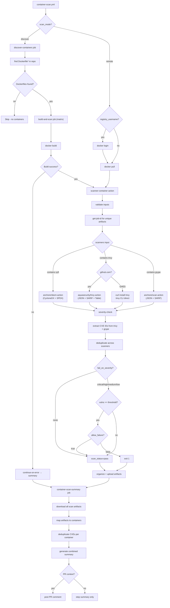

# Argus Test Suite

Comprehensive test suite for [huntridge-labs/argus](https://github.com/huntridge-labs/argus) — validates the container security scanning composite actions, reusable workflows, and the full scanner ecosystem.

## What's Being Tested

| Component | Purpose |
|-----------|---------|
| `container-scan.yml` | Reusable workflow: discover (find Dockerfiles) or remote (scan existing images). Drives the argus CLI via `setup-argus` |
| `infrastructure-scan.yml` | Reusable workflow for trivy-iac + checkov |
| `container-scan-from-config.yml` | Reusable workflow for config-driven multi-container scanning |
| `parse-container-config` | Composite action: generates matrix from `container-config.yml` |
| `security-summary` | Composite action: stitches per-container summaries, renders the pass/fail table, enforces `fail_on_scanner_failure` |
| `setup-argus` | Composite action: installs the argus Python package the scan workflows call |
| SCN detector | Significant Change Notification detector: AI classifier, diff helpers, report generation |

**Not covered here.** As of argus 1.x, `container-scan.yml` invokes
`python -m argus scan container` directly and no longer calls the
`scanner-container` or `scanner-container-summary` composite actions, so
nothing in this suite exercises them — they are still published for GHES and
direct-action consumers. Unit-level parser coverage also moved into argus's own
`test-unit.yml` when the scanner logic moved from action-embedded scripts into
the `argus` package. This suite's job is the *consumer contract*: that a
downstream repo calling `@main` still gets the behaviour it expects.

## Dashboard

Test results are published to GitHub Pages with each run. The page is three
blocks, in priority order:

1. **Status header** &mdash; an A&ndash;F grade, passed/defined, movement against the
   previous run, the argus ref/version/commit under test, and a score-by-date
   chart. Counts double as filters.

   The grade is `passed ÷ every test the suite defines`, so tests that did not
   run count as *no assurance* rather than silently vanishing &mdash; otherwise a
   suite that skips most of itself and passes the rest would score an A. A
   failing test then caps the grade at B, because "96% passing" is not an A when
   the missing 4% is a severity gate that stopped enforcing.
2. **Search** &mdash; one box that answers whether a behaviour is tested (below).
3. **One flat table of every entry** &mdash; all 81 tests and all 19 coverage notes,
   visible without a single click, grouped by category with a sticky header.
   Failing rows are tinted; every row links to the exact line of the workflow
   that defines it, and separately to the logs of the job that ran it.

   The five unit rows each stand for a whole pytest file, so they also list the
   individual assertions behind them. Each unit job runs `pytest --collect-only`
   and publishes the collected names, which the page shows under the question
   and folds into the search index &mdash; so searching *"duplicate container
   names"* finds U1. Collection is best-effort: if a job collects nothing, the
   row says so, which is itself the signal that its paths have moved upstream.

Searching filters that same table rather than rendering a second list, so there
is only ever one place to read a result.

### "Is this behaviour already tested?" search

The dashboard has a search box that answers whether a behaviour you expect from
argus is covered. Type what you expect in plain language &mdash; *"block the build
when a critical CVE is found"*, *"private registry credentials"*, *"detect
secrets in a repo"* &mdash; and it returns a verdict, not just a filtered list:

| Verdict | Meaning |
|---------|---------|
| **Yes — covered by N tests** | A test asserts this. Open it and confirm it asserts what you actually mean. |
| **No — this is a known gap** | Considered and deliberately untested. The reason is shown inline. |
| **Maybe — nothing matches closely** | Nearest entries shown. If none fit, treat it as untested. |
| **No match — this looks untested** | Nothing in the suite or the gap list resembles it. |

Three things make the "no" answers trustworthy:

- **Gaps are searchable, and tracked.** `.github/data/coverage-gaps.json` holds
  one stub per known gap, each linking to the issue that tracks it (#6&ndash;#11).
  Search still answers *"no, and here is why"*, but the reasoning and the work
  live in the issue tracker where they can be assigned and closed, rather than
  as prose on a dashboard.

  What this file deliberately does **not** list is coverage argus's own CI
  provides. An earlier version enumerated ten such entries; the list had no
  natural boundary (argus tests ~25 composite actions plus a full pytest suite),
  and this suite should take no credit for work it does not do.
- **The verdict cut is relative.** A long query divides its score across more
  terms, so a fixed threshold would call a genuine match "maybe". The cut floats
  at 85% of the best hit with an absolute floor.
- **The index is built from the workflow definitions, not the run.** A push runs
  `scope=all`, which skips the SCN tests &mdash; without this, all 25 would look
  untested. The catalog is parsed from `test-*.yml` at dashboard build time, so
  every defined test is searchable and ones that did not run are labelled
  *not run in this scope*.

**Filters live in the same box.** The status counts in the header are buttons,
but clicking one writes an `is:` token into the search query rather than setting
a separate state &mdash; `is:failing`, `is:passing`, `is:not-run`, and also
`is:gap`, `is:untested`, `is:upstream`. They compose with free text
(`is:failing severity gate`) and you can type them directly. Two independent
filters ANDing together invisibly was the failure mode: you could search, get
nothing back, and never see that a chip set minutes ago was excluding every
match. Now there is one state, it is visible in the box, clearing the box clears
it, and the URL carries it so a filtered view is a shareable link. If a filter
does hide every match, the page says so and offers to drop it, rather than
claiming the behaviour is untested.

Typing offers an inline completion in grey, accepted with `Tab` or `→`, drawn
from the example queries first and then every test question &mdash; so typing
`does argus fail the workflow when a discov` lands you on the exact test.

Matching is concept-aware rather than literal: a domain thesaurus maps *block /
reject / gate / enforce* onto the same concept as *fail*, *SBOM* onto *syft*,
*credentials* onto *registry auth*, and so on, ranked by IDF-weighted term and
concept overlap. It is deliberately not an embedding model &mdash; the page is
static, has no backend and can hold no API key, and on a ~100-entry corpus of
domain jargon like `allow_failure` a thesaurus does better than a general
sentence model would. Results deep-link (`?q=...`), and `/` focuses the box.

## Testing Feature Branches

You can test an Argus feature branch before merging to main:

```bash
# Test a feature branch (unit + action tests use the custom ref)
gh workflow run test-suite.yml -f argus_ref=feat/my-feature

# Test only unit tests against a branch
gh workflow run test-suite.yml -f scope=unit -f argus_ref=feat/my-feature

# Test only direct action tests against a branch
gh workflow run test-suite.yml -f scope=actions -f argus_ref=feat/my-feature
```

**Scope of feature branch testing:**
- **Unit tests (U1-U5):** Full support — checkout argus at the specified ref and run pytest
- **Direct action tests (A1-A5):** Full support — checkout argus at the specified ref and use local action paths
- **Remote/Discover/Combination tests:** Always test `@main` — GitHub Actions requires static refs for reusable workflow `uses:` directives
- **Regression tests:** I2 uses the custom ref; I1 always tests `@main`

## Execution Path



## Test Matrix (81 tests)

### Reading the expectations

Several tests expect the reusable workflow to **fail** — that is the passing
outcome, and the validator asserts the exact expected result rather than
assuming `success`. Two argus gates make a run fail closed, both keyed on
`allow_failure` (added in argus `739ac35e`, 2026-07-09):

| Gate | Where | Fires when |
|------|-------|-----------|
| Severity | `continue-on-error: ${{ inputs.allow_failure == true }}` on the scan job | any finding's severity >= `fail_on_severity` |
| Build | `Fail if the image build failed` step | a discovered Dockerfile does not build |

Before that commit the scan job was unconditionally `continue-on-error` and
every threshold test returned `success` regardless of findings.

**Determinism anchors.** Public image contents drift, so a gate outcome is only
asserted where the margin is overwhelming:

| Anchor | Image | Property |
|--------|-------|----------|
| DIRTY | `nginx:1.19.0` | 2020 Debian buster base — trips every threshold |
| CLEAN | `gcr.io/distroless/static-debian12` | no package DB — trips no threshold |
| UNKNOWN | `alpine:3.18` | EOL, counts drift — **never** carries a gate assertion |

### Unit Tests — `test-unit.yml`

| # | Test | Validates |
|---|------|-----------|
| U1 | parse-container-config | Config parsing, schema validation, matrix generation (Python/pytest) |
| U2 | scanner-container | Trivy parser, Grype parser, summary generation (Python/pytest) |
| U3 | other scanner tests | Checkov, ClamAV, CodeQL, OpenGrep, Trivy-IaC, ZAP parsers (Python/pytest) |
| U4 | scn-detector tests | SCN detector AI classifier, diff helpers, report generation (Python/pytest) |
| U5 | GHES static analysis | No hardcoded github.com URLs in action logic |

### Remote Mode Tests — `test-remote.yml`

| # | Test | Image | Scanners | Severity | allow_failure | Expected | Category |
|---|------|-------|----------|----------|---------------|----------|----------|
| R1 | remote-vuln-all-scanners | nginx:1.19.0 | trivy,grype,syft | none | false | PASS, vulns found | TP-detect |
| R3 | remote-trivy-only | alpine:3.18 | trivy | none | false | PASS, trivy only | scanner isolation |
| R4 | remote-grype-only | alpine:3.18 | grype | none | false | PASS, grype only | scanner isolation |
| R5 | remote-syft-only | alpine:3.18 | syft | none | false | PASS, SBOM only | scanner isolation |
| R6 | remote-fail-critical | nginx:1.19.0 | trivy,grype | critical | false | **FAIL** (gate fires) | TP-threshold |
| R7 | remote-pass-none | nginx:1.19.0 | trivy,grype | none | false | PASS despite vulns | TN-threshold |
| R8 | remote-allow-failure | nginx:1.19.0 | trivy | high | true | PASS (bypassed) | allow_failure |
| R9 | remote-bad-image | nonexistent/nosuchimage:v0 | trivy | none | false | Graceful error | error handling |
| R10 | remote-clean-strict | distroless/static-debian12 | trivy,grype | low | false | PASS | TN-threshold |
| R11 | remote-sbom-never-gates | alpine:3.18 | syft | low | false | PASS (SBOM emits no findings) | TN-precision |
| R12 | remote-dedup-validation | nginx:1.19.0 | trivy,grype | none | false | PASS, **unique < total asserted from the report** | dedup logic |

### Discover Mode Tests — `test-discover.yml`

`tests/dockerfiles/broken/Dockerfile` is in every discover run (discover globs
the whole caller repo), so in this repo `allow_failure: false` always fails on
the build gate. The suite is split along exactly that line.

| # | Test | Scanners | Severity | allow_failure | Expected |
|---|------|----------|----------|---------------|----------|
| D1 | discover-mixed | trivy,grype | none | true | PASS — 3 Dockerfiles found, broken one tolerated |
| D2 | discover-trivy-only | trivy | none | true | PASS — single scanner in discover mode |
| D3 | discover-fail-closed | trivy,grype | critical | false | **FAIL** — both gates live |
| D4 | build-gate-isolated | trivy | none | false | **FAIL** — severity gate disabled, so only the broken build can fail it |

**Known gap.** "Severity gate fires in discover mode, build gate does not" is
not testable here: any run that could observe it (`allow_failure: false`) has
already failed on the broken build. Isolating it needs a repo with no broken
Dockerfile, or a `search_paths` input on `container-scan.yml`'s discover step
(`argus.yml` has `containers.search_paths`; the workflow does not expose it).
Remote-mode C3–C6 walk the severity ladder in the meantime.

### Direct Action Tests — `test-actions-direct.yml`

| # | Test | Config | Expected |
|---|------|--------|----------|
| A1 | config-single-public | tests/configs/single-public.yml | 1 entry, has_containers=true |
| A2 | config-multi-container | tests/configs/multi-container.yml | 3 entries, 6+ scan_matrix entries |
| A3 | config-structured-image | tests/configs/structured-image.yml | Image ref built from components |
| A4 | config-all-options | tests/configs/all-options.yml | Full schema: registry, auth, all flags |
| A5 | config-invalid-duplicate | tests/configs/invalid-duplicate.yml | Duplicate names rejected |

### Combination Tests — `test-combination.yml`

Pairwise coverage tests filling gaps in the parameter space (mode x scanners x severity x allow_failure x image).

C3–C6 walk the full severity ladder against the DIRTY anchor and all expect the
workflow to **fail**; C7 is the negative control at the same threshold. C10–C13
run with `allow_failure: true` because the broken Dockerfile fixture would
otherwise fail them on the build gate — which means they assert "the workflow
completes and produces a summary", not "the scan found something". Artifact
assertions (E12) are what upgrade that.

| # | Mode | Scanners | Severity | allow_failure | Image | Gap filled |
|---|------|----------|----------|---------------|-------|------------|
| C1 | remote | trivy+syft | none | false | nginx:1.19.0 | Scanner pair TS |
| C2 | remote | grype+syft | none | false | nginx:1.19.0 | Scanner pair GS |
| C3 | remote | trivy | medium | false | nginx:1.19.0 | `medium` severity — **FAIL** expected |
| C4 | remote | grype | high | false | nginx:1.19.0 | `high` standalone — **FAIL** expected |
| C5 | remote | grype | critical | false | nginx:1.19.0 | Grype threshold — **FAIL** expected |
| C6 | remote | trivy | low | false | nginx:1.19.0 | `low` completes the ladder — **FAIL** expected |
| C7 | remote | syft | critical | false | nginx:1.19.0 | Negative control: SBOM-only cannot gate |
| C8 | remote | trivy+grype | critical | true | nginx:1.19.0 | Multi-scanner + allow_failure |
| C9 | remote | grype | low | true | distroless | grype + allow_failure + clean |
| C10 | discover | trivy | medium | true | — | discover + allow_failure |
| C14 | remote | trivy+grype+syft | high | true | alpine:3.18 | All scanners + threshold + allow |

### Edge & Adversarial Tests — `test-edge.yml`

R/D/C cover the parameter space a caller is *meant* to use. E covers what
callers actually send by accident, and the paths where argus can return a green
check without having scanned anything. Most use the CLEAN anchor so the
severity gate can never be what fails them — the input under test is the only
variable.

Two labels, so a red cell is interpretable:

- **CONTRACT** — documented behaviour. A red means argus regressed.
- **POLICY** — argus has no stated contract; the test asserts the
  security-correct outcome. A red is an open question for argus, not a broken
  test. Deliberately not written as "accept either outcome" — a test that
  passes both ways tells you nothing.

| # | Test | Kind | Scenario | Expected |
|---|------|------|----------|----------|
| E1 | digest-pinned image | CONTRACT | `nginx@sha256:...`, digest resolved at runtime | PASS |
| E2 | fully-qualified host | CONTRACT | `docker.io/library/alpine:3.18` vs the short form | PASS |
| E3 | messy scanners list | CONTRACT | padding, mixed case and a repeat in one input | PASS |
| E5 | no valid scanner | POLICY | `scanners: bogusscanner` — nothing runs | **FAIL** expected |
| E6 | valid + typo'd scanner | CONTRACT | `trivy,bogusscanner` — unknown name dropped | PASS |
| E7 | container_name sanitisation | CONTRACT | `"Edge/Case Name"` through artifact naming | PASS |
| E8 | auth without password | CONTRACT | `registry_username` set, secret missing | **FAIL** expected |
| E9 | empty image_ref | POLICY | remote mode, `image_ref: ""` — every scan job skips | **FAIL** expected |
| E10 | packageless image | CONTRACT | `hello-world` has no package DB | PASS |
| E11 | SARIF, zero findings | CONTRACT | `enable_code_security: true` on a clean image | PASS |
| E12 | scan artifact content | CONTRACT | downloads E2's summary artifact, asserts the scan ran | PASS |

**E12 is the pattern, not just a test.** `container-scan.yml` declares no
`workflow_call` outputs, so every other test in this repo can only assert a job
result — which proves the workflow completed, not that a scanner ran or that it
looked at the right image. The reusable workflow does upload
`scanner-summary-container-<name>` into the same run, so a caller-side job can
download it and assert on content. That block is what would let C10–C13 assert
something real. Asking argus for `workflow_call` outputs (counts, per-scanner
status) would remove the need for it.

### Top-level Workflow Tests — `test-workflows.yml`

`reusable-security-hardening.yml` is argus's consumer-facing orchestration
layer, and nothing exercised it &mdash; not this suite, and not argus's own CI,
because its only caller is a `workflow_dispatch`-only demo. These four tests
close that. They assert the orchestration (does a `scanners` selection resolve
into the right jobs, do they run, does the summary stitch them), not the
scanners underneath, which argus CI already covers. All run with
`allow_failure: true` so findings cannot decide the outcome.

| # | Selection | Asserts |
|---|-----------|---------|
| W1 | `trivy-iac` against `tests/iac` | a single-scanner selection resolves and runs |
| W2 | `lint` | a different scanner family resolves through the same coordinator |
| W3 | `gitleaks,trivy-iac` | fan-out plus summary stitching for a multi-scanner selection |
| W4 | `bogusscanner` | an unrecognised name finishes cleanly rather than crashing |

`security-scan.yml` is deliberately **not** tested: it declares only
push/schedule/dispatch, so it is argus scanning itself rather than anything a
consumer can call.

### SCN Detector Tests — `test-scn-detector.yml`

Validates the [argus scn-detector](https://github.com/huntridge-labs/argus) action — classifies IaC changes into FedRAMP SCN categories. Run with `scope=scn`.

| # | Test | IaC Format | Expected Category | Validates |
|---|------|-----------|-------------------|-----------|
| S1 | routine-tags | Terraform | ROUTINE | `tags.*` pattern match |
| S2 | routine-description | Terraform | ROUTINE | `description` pattern match |
| S3 | adaptive-instance-type | Terraform (modify) | ADAPTIVE | `instance_type` modify rule |
| S4 | adaptive-iam-attachment | Terraform | ADAPTIVE | `aws_iam_policy_attachment` create |
| S5 | transformative-iam-role | Terraform | TRANSFORMATIVE | `aws_iam_role` create |
| S6 | transformative-db-engine | Terraform (modify) | TRANSFORMATIVE | `aws_rds_*` engine modify |
| S7 | impact-encryption | Terraform (modify) | IMPACT | Encryption removal |
| S8 | impact-public-sg | Terraform | IMPACT | `0.0.0.0/0` ingress pattern |
| S9 | impact-iam-user | Terraform | IMPACT | `aws_iam_user` create |
| S10 | kubernetes-detection | Kubernetes | detected | K8s YAML format detection |
| S11 | cloudformation-detection | CloudFormation | detected | CFN YAML format detection |
| S12 | no-iac-changes | non-IaC | NONE | `has_changes=false` |
| S13 | fail-on-impact | Terraform | IMPACT (fails) | `fail_on_category=impact` enforcement |
| S14 | fail-on-adaptive | Terraform | ADAPTIVE (fails) | `fail_on_category=adaptive` enforcement |
| S15 | mixed-multi-category | Terraform (multi-file) | IMPACT | Highest category wins |
| S16 | dry-run-issues | Terraform | ADAPTIVE | Dry-run mode: issue payloads without API calls |
| S17 | manual-review | Terraform | MANUAL_REVIEW | Unmatched resource triggers manual review |
| S18-S25 | additional coverage | Various | Various | Delete ops, custom profiles, multi-resource, AI fallback |

### Regression Tests — `test-suite.yml`

| # | Test | Validates |
|---|------|-----------|
| I1 | infrastructure-scan | trivy-iac + checkov still work |
| I2 | no-hardcoded-urls | No github.com URLs in action shell scripts |
| I3 | config-driven-scan | container-scan-from-config.yml reusable workflow still works |

## Quick Start

```bash
# Runs automatically on every push to main (concurrency: 1)
# Also runs weekly on Sunday 9am UTC

# Run full suite manually
gh workflow run test-suite.yml

# Run specific scope
gh workflow run test-suite.yml -f scope=unit
gh workflow run test-suite.yml -f scope=remote
gh workflow run test-suite.yml -f scope=discover
gh workflow run test-suite.yml -f scope=actions
gh workflow run test-suite.yml -f scope=combination
gh workflow run test-suite.yml -f scope=edge
gh workflow run test-suite.yml -f scope=workflows
gh workflow run test-suite.yml -f scope=scn

# Test an argus feature branch
gh workflow run test-suite.yml -f argus_ref=feat/my-feature

# Monitor
gh run watch
```

## Repository Structure

```
.github/workflows/
  test-suite.yml             Orchestrator (push + dispatch + weekly)
  test-remote.yml            12 remote mode tests
  test-discover.yml          4 discover mode tests
  test-actions-direct.yml    5 composite action tests
  test-combination.yml       15 pairwise combination tests
  test-edge.yml              12 edge & adversarial tests
  test-scn-detector.yml      25 SCN detector tests (on-demand)
  test-unit.yml              5 unit tests (Python/pytest)

.github/scripts/
  generate-dashboard.sh      Dashboard HTML generator (+ coverage search index)

.github/data/
  coverage-gaps.json         Known gaps + argus surface this suite does not cover.
                             Feeds the dashboard's "is this tested?" search so a
                             "no" comes with a reason. Add an entry whenever you
                             decide not to test something.

tests/
  dockerfiles/
    good/Dockerfile           FROM alpine:3.18
    vulnerable/Dockerfile     FROM node:14-slim (known CVEs)
    broken/Dockerfile         Invalid (tests error handling)
  configs/
    single-public.yml         1 public container
    multi-container.yml       3 containers, mixed scanners
    structured-image.yml      Structured image object format
    all-options.yml           Every config field populated
    invalid-duplicate.yml     Duplicate names (schema error)
    custom-scn-profile.yml    Custom SCN classification profile
```

## TP/TN Coverage Matrix

|  | Scanner finds vulns | Scanner finds nothing |
|--|--------------------|-----------------------|
| **Image IS vulnerable** | R1, R6, R8, R12 (True Positive) | Bug — caught by R1 assertion |
| **Image is clean** | Bug — caught by R2/R10 assertion | R2, R10 (True Negative) |

|  | Gate fails the workflow | Gate lets it pass |
|--|------------------------|-------------------|
| **Findings meet threshold** | R6, C3, C4, C5, C6, D3 (True Positive) | R8, C8 — only via `allow_failure: true` |
| **No findings meet threshold** | Bug — caught by R10/C15/E10 | R7, R10, R11, C7, C15, E10 (True Negative) |

The bottom-left cell is the one that matters: a gate firing when it shouldn't
is noisy, but a gate *not* firing when it should ships a vulnerable image behind
a green check. R6/C3–C6/D3 are what go red if enforcement silently stops — and
before this suite was corrected they asserted `success`, so they would not have.

## Pairwise Coverage

After the C-series combination tests, parameter pair coverage is:

| Parameter Pair | Coverage |
|---------------|----------|
| mode x scanners | 14/14 (100%) |
| mode x severity | 10/10 (100%) |
| mode x allow_failure | 4/4 (100%) |
| severity x allow_failure | 8/10 (80%) |
| scanners x severity | 21/35 (60%) |

syft x severity is now covered rather than dismissed: R11 (syft x low) and C7
(syft x critical) assert that an SBOM-only scan cannot trip the gate. That is
worth pinning precisely *because* syft does no vulnerability scanning — it is
what stops an SBOM run from silently gaining a gating path. The remaining gaps
are the other syft-involving cells.

## On redundancy

The suite was pruned once its parameter matrix was tabulated rather than read.
Six tests went, none of them losing coverage:

| Removed | Because |
|---------|---------|
| R2, C15 | same image and scanners as R10 at looser thresholds, so R10 subsumes both |
| C11, C12, C13 | all discover with `allow_failure: true`, which disarms both gates, so the scanner and severity differences could not change the outcome. Three tests asserting what C10 already asserts, at roughly 18 runner jobs |
| E4 | the same normaliser as E3, on the same image, with the same expectation. E3 now carries padding, mixed case and a repeat in one input |

R12 stayed but was rewritten. It had parameters byte-identical to R7 and checked
only that the job returned success, so its stated purpose &mdash; cross-scanner
deduplication &mdash; was never exercised. It now reads the scan report and
asserts the unique count came out below the total, which is what
deduplication means.

## Gaps and Open Questions

| Item | Status |
|------|--------|
| Discover-mode severity gate in isolation | Not testable while `broken/Dockerfile` exists and `container-scan.yml` exposes no `search_paths` |
| Counts, per-scanner status, dedup totals | Not observable — `container-scan.yml` declares no `workflow_call` outputs; E12 works around it via artifacts |
| Unscannable image exit code (R9) | Deliberately loose — argus states no contract for "nothing could be scanned", so R9 accepts both outcomes |
| `scanners: bogusscanner` (E5) | POLICY assertion — unknown scanner names are dropped silently by `argus/scanners/container.py` |
| `image_ref: ""` in remote mode (E9) | POLICY assertion — both scan jobs skip and only the summary runs |
